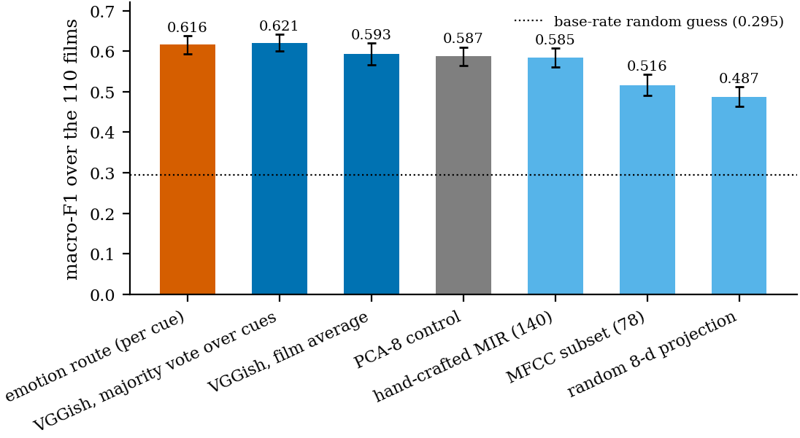
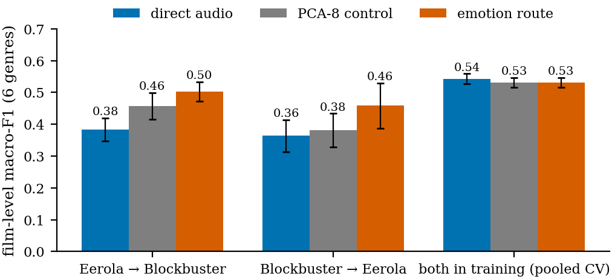
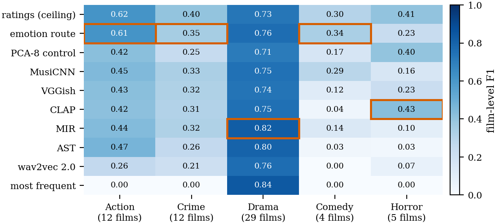

# Supervisor briefing — update since the fifth meeting (8 October 2026)

**Can a soundtrack's emotion predict a film's genre?** This page covers what was done after
the fifth meeting: the four notes, a data error found while answering the second one, and
what both changed. The briefing for the fourth meeting is archived in
`docs/archive/current_state_2026-10-07.md`; every earlier round is in `briefing_full.md`,
and every experiment in detail in the technical log, `docs/README.md` (section 24 for this
round). The thesis on Overleaf is up to date with everything below.

All genre scores are **film-level macro-F1** (the clip probabilities of a film are
averaged and the film is scored once); the clip-level value of the same predictions is
given where it matters.

---

## 1. Your notes from the meeting

| # | Your note | What was done | Result |
|---|---|---|---|
| 1 | Blockbuster cross-validation as a bar chart, but with SD | Two bar charts with error bars (section 3) | Blockbuster in-domain: the routes are level; across datasets the error bars show how much a single split can move |
| 2 | Films common to Eerola and Blockbuster (leakage) | Checked every IMDb id and title (section 4) | **No film is in both datasets.** But inside Eerola **one film was counted twice** — fixed, and every Eerola result re-run (section 2) |
| 3 | F1, precision and recall per genre; the best model per genre; a diagram | Per-genre heatmap and table (section 5) | The emotion route is best on Action, Crime and Comedy; MIR on Drama; CLAP on Horror |
| 4 | Focus the Evaluation on a few results; be more precise in the Discussion | Evaluation rebuilt around the core results, the rest in a new Appendix A; Discussion shortened (section 6) | Evaluation 990 → about 530 lines, Discussion 340 → about 200 |

---

## 2. A data error found while checking note 2

Eerola clip 256 is labelled **"The Portait of a Lady"** (a typo), the film's six other clips
**"The Portrait of a Lady"** — the same film (same IMDb id). Every split groups clips by
this name, so the film counted as two films and one of its clips could be tested while the
other six were in training: a small leak, and wrong film counts everywhere.

- **Fixed in the loader** (the two spellings are merged); the dataset has **42 films** on
  eight genres and **40** on five, not 43 and 41; clips per film range from 2 to 18.
- **Every Eerola experiment that groups by film was re-run** (16 scripts, about two hours).
  Each re-run reproduced the one before it exactly, so the changes come from the
  grouping alone.
- The numbers moved by about the size of the split noise (0.01 to 0.03), because merging
  the two names changes which films land in which fold. Some conclusions changed with them
  (section 7).

---

## 3. Note 1 — bar charts with SD

**Blockbuster in-domain** (10×5 cross-validation over the 110 films; error bars = SD of the
10 repeat means):

The emotion route (0.616 ± 0.022) is level with direct audio: VGGish film average
0.593 ± 0.028 (Nadeau–Bengio p = 0.536), VGGish with a majority vote over cues
0.621 ± 0.020, PCA-8 0.587, hand-crafted MIR 0.585; random guess 0.295.

**Across datasets** (error bars: bootstrap SD over the test films for the two transfer
directions, SD of the 5 repeat means for the pooled design):

| design | emotion | PCA-8 | direct | emotion − direct |
|---|---:|---:|---:|---|
| Eerola → Blockbuster (re-implementation) | 0.503 ± 0.030 | 0.457 | 0.383 ± 0.037 | +0.121, p = 0.007 |
| Blockbuster → Eerola, 40 films | 0.458 ± 0.071 | 0.381 | 0.364 ± 0.050 | +0.089, **p = 0.102** |
| both in training (pooled, per film) | 0.531 ± 0.015 | 0.531 | 0.543 ± 0.016 | -0.011, p = 0.688 |

The error bars of a single transfer split are large (about ±0.03 to ±0.07), which is why
the comparisons rest on the paired bootstrap rather than on the bars overlapping or not.

---

## 4. Note 2 — leakage between the datasets

- **No common film.** None of the 42 Eerola films' IMDb ids occurs among the 110
  Blockbuster films, and no title matches (also not loosely). The Eerola films are all from
  before 2011, the Blockbuster films from 2014 to 2019.
- **Shared composers, not shared films.** Some composers scored films in both, e.g. Danny
  Elfman (*Batman* in Eerola, *Justice League* in Blockbuster, which quotes his Batman
  theme). That is stylistic overlap, not a leak; the thesis names it as a limitation.
- **The leak that did exist was inside Eerola** (section 2), and it is fixed.

---

## 5. Note 3 — results per genre

| genre | films | best route (F1) | emotion route P / R / F1 | VGGish P / R / F1 |
|---|---:|---|---|---|
| Action | 12 | emotion route (0.61) | 0.52 / 0.76 / **0.61** | 0.39 / 0.47 / 0.43 |
| Crime | 12 | emotion route (0.35) | 0.28 / 0.47 / **0.35** | 0.29 / 0.37 / 0.32 |
| Drama | 29 | MIR (0.82) | 0.87 / 0.68 / **0.76** | 0.79 / 0.69 / 0.74 |
| Comedy | 4 | emotion route (0.34) | 0.22 / 0.78 / **0.34** | 0.12 / 0.12 / 0.12 |
| Horror | 5 | CLAP (0.43) | 0.15 / 0.50 / **0.23** | 0.21 / 0.26 / 0.23 |

- The emotion route is the **best route for Action, Crime and Comedy**; the hand-crafted MIR
  features are best on Drama and CLAP on Horror.
- Its advantage is mostly **recall on the rare genres**: averaged over the five genres
  recall 0.64 vs 0.38 for VGGish, at precision 0.41 vs 0.36. Comedy is the clearest
  case (recall 0.78 vs 0.12).
- **Horror is the exception**: the emotion route finds half the Horror films but predicts
  the genre for too many others (precision 0.15).
- With 4 Comedy and 5 Horror films, one film moves a genre's F1 by about 0.2: this is a
  description, not a test.

---

## 6. Note 4 — a focused Evaluation and a more precise Discussion

**Main text of Chapter 5 now:** Stage 1 (emotion regression, short) → RQ1 → emotion vs
direct audio with **one 4-row comparison table** → **results per genre** (new) → emotional
signatures and their replication → transfer (Blockbuster in-domain chart, leakage check,
zero-shot, the three cross-dataset designs with SD) → a one-page summary.

**Moved to the new Appendix A** (each with one sentence and a pointer in the main text):
all paired comparisons and the Nadeau–Bengio limit, the metric family and the threshold
analysis, stability over seeds, the emotion ablation, the waveform representation, all
eight genres, the reproduction of Ma et al. with the cue-level analysis, and the error
analysis.

**Discussion:** built around one table of all settings; one paragraph each for the
in-domain and the cross-dataset result; the "why" section reduced to meaning vs
compression, scarce data and domain shift; limitations as short paragraphs.

---

## 7. What changed in the numbers (before → after the duplicate fix)

| | before | after |
|---|---:|---:|
| emotion route, 5 genres (film level) | 0.469 | **0.460** |
| ratings (ceiling) | 0.521 | 0.491 |
| direct VGGish / best direct (MusiCNN) | 0.375 / 0.385 | 0.367 / 0.396 |
| PCA-8 control | 0.418 | 0.390 |
| emotion vs VGGish (film bootstrap) | +0.095, p = 0.047 | +0.093, **p = 0.052** |
| emotion vs PCA-8 | +0.051, p = 0.326 | +0.070, p = 0.089 |
| predicted vs rated emotion | −0.053, p = 0.053 | -0.032, p = 0.277 |
| 8 genres: emotion vs VGGish | +0.096, p = 0.002 | +0.093, p = 0.001 |
| zero-shot: emotion vs direct | 0.511 vs 0.407, p = 0.018 | 0.508 vs 0.403, p = 0.013 |
| Blockbuster → Eerola (per film) | +0.077, p = 0.127 | +0.089, p = 0.102 |
| Stage 1, best R² | 0.561 | 0.558 |

**What this changes in the thesis.**
- In-domain, the emotion route is still ahead of every direct representation in nearly
  every repeat and under every seed, but its lead is now significant only against the
  weaker ones (AST, hand-crafted MIR, wav2vec 2.0). Against VGGish it **just misses**
  (p = 0.052), against CLAP, MusiCNN and PCA-8 it is not significant.
- **Film level is the stricter unit.** Over clips the film bootstrap finds the lead
  significant against VGGish, CLAP, MusiCNN and PCA-8; over films it does not. So the
  film-level choice does not favour the method — the thesis says so.
- The zero-shot result is unchanged in substance; the cross-dataset conclusions stand.

---

## 8. Open items

1. **Write the held-back parts** (abstract, Chapter 7, contributions). The drafts in
   `docs/latex/held_back/` quote numbers from before the film-level switch *and* the fix;
   use section 7 above.
2. **Read Chapters 5, 6 and Appendix A in full.** They were rebuilt today; the Discussion's
   interpretation must become your own.
3. **Zero-shot with a threshold tuned on the source dataset** — still not run.
4. **AI declaration**: two red notes and the date.

---

## 9. Questions to expect, and the answers

**Is the emotion route better in-domain?**
It is ahead of every direct audio representation (by +0.093 over VGGish, its own input) in
9 or all ten repeats and under every seed, but on 40 films its lead is significant
only against the weaker representations; against VGGish p = 0.052. Part of the gain is
compression (PCA-8 is also ahead of VGGish under every seed) and part is the default
threshold (with tuned thresholds the routes converge, 0.420–0.433 over clips).

**What is the main result then?**
The emotion route is clearly ahead where the classifier is trained on the small Eerola
dataset — in-domain and from Eerola to Blockbuster (0.508 vs 0.403, p = 0.013) — and
level where it is trained on the 110 Blockbuster films or on both. Its emotional
signatures replicate on Blockbuster (r = 0.836).

**Could the transfer result come from films that are in both datasets?**
No: no film is in both (section 4).

**Why do the numbers differ from the last meeting?**
A film was counted twice in Eerola; fixing it changed every split (section 2).

**Why is box office not in the thesis?**
It answers a question about commercial success, not genre: classification quality does
not relate to gross (Eerola ρ = +0.197), and the score's emotions relate to it only
through the budget (anger ρ = +0.43, budget–gross ρ = +0.78).

---

## Headline numbers as they stand

Each row is its own label space, compared only against its own chance level:

| setting | emotion route | best direct audio | random guess |
|---|---:|---:|---:|
| Eerola, 5 genres, in-domain, film level | **0.460** | 0.396 (MusiCNN); VGGish 0.367 | 0.309 |
| Eerola, 5 genres, in-domain, clip level | 0.405 | 0.366 (VGGish) | 0.307 |
| Eerola, 5 genres, clip level, tuned thresholds | 0.420 | 0.423 (VGGish) | 0.307 |
| Eerola, 8 genres, film level | 0.349 | 0.257 (VGGish) | 0.226 |
| Eerola, 8 genres, clip level | 0.317 | 0.278 (AST) | — |
| Eerola → Blockbuster, zero-shot | **0.508** | 0.403 (VGGish) | 0.292 |
| Blockbuster → Eerola, 40 films | 0.458 | 0.364 (VGGish) | 0.240 |
| Blockbuster, in-domain | 0.616 | 0.621 (VGGish, majority vote) | 0.295 |

Significance, in-domain (5 genres, film bootstrap): emotion vs VGGish p = 0.052, vs PCA-8
p = 0.089; over clips, Nadeau–Bengio p = 0.086 vs VGGish. Zero-shot: +0.106 [+0.021,
+0.184], p = 0.013. Stability (clip level): SD over the 10 repeats 0.019 for the
emotion route. Exact match of the most-frequent baseline: 0.283.
