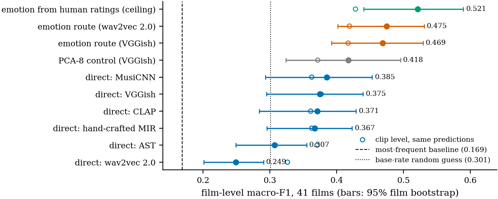
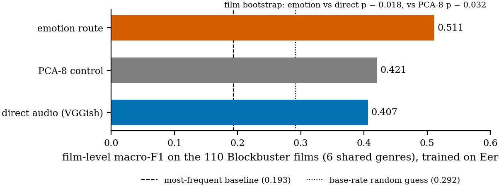
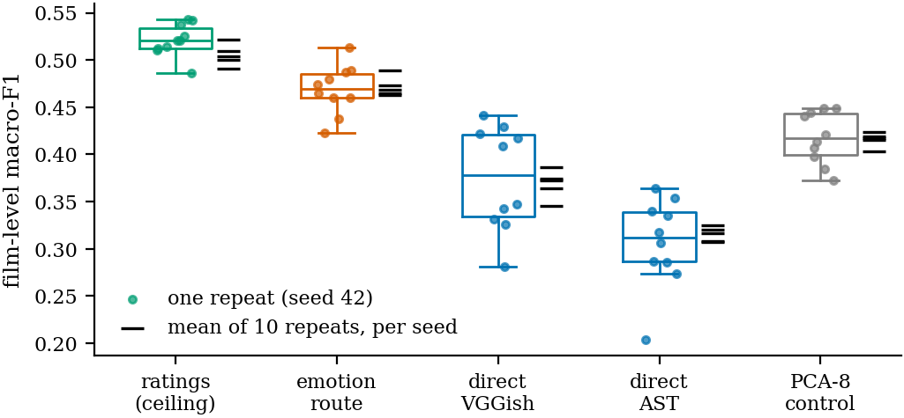
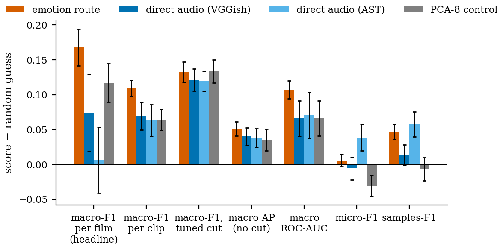

# Supervisor briefing — update since the last meeting

**Can a soundtrack's emotion predict a film's genre?** This page covers only what happened
since the fourth meeting (24 September 2026): the six notes from that meeting, what came
of them, and the work on the thesis text that followed (state: 7 October 2026). Earlier rounds, the three routes (direct audio, emotion route, PCA-8
control), the definitions, every result table and the previous Q&A are in
`briefing_full.md`; every experiment in detail is in the technical log, `docs/README.md`
(section 22 for this round).

---

## 1. Your notes from the last meeting

| # | Your note | What was done | Result |
|---|---|---|---|
| 1 | Explain the F1 metric more; is there a better approach? | Every route scored under 13 metrics on the same predictions (section 2) | **Macro-F1 stays the right headline**, but the in-domain lead **depends on the decision threshold** |
| 2 | Standard deviation / variance of the cross-validation: stable and reproducible? | Spread over repeats, folds, films and five master seeds (section 3) | **Stable and reproducible**; the emotion lead is positive under every seed |
| 3 | Box office vs the Blockbuster dataset, under all metrics | Worldwide gross for all 110 films; 6 per-film metrics, emotions, genre, prediction, all 140 MIR features (section 4) | Classification quality: **no relation**. Emotions: **only through the budget**. Then **left out of the thesis** (7 Oct) |
| 4 | Write the rest of the chapters | Full drafts of every remaining chapter and the abstract (section 5) | **On Overleaf, compiles with 0 errors**; reviewed, style-revised, references checked. Abstract, conclusions and contributions held back for the author |
| 5 | Results as graphs, not only tables | Figures drawn directly from the results files (section 6) | Eight figures in the Evaluation chapter, with short captions |
| 6 | Figures from other papers are allowed, with the source | Noted (section 6) | The circumplex figure could now be the original |

---

## 2. Note 1 — the F1 metric, and whether there is a better one

### What F1 measures

For **one genre**, say Horror:

- **Precision** = of the clips the model *called* Horror, the share that really are.
- **Recall** = of the clips that really *are* Horror, the share the model found.
- **F1** = the harmonic mean of the two, `2·P·R / (P + R)`. It is high only when both are
  high: a model that calls everything Horror has recall 1 but poor precision, and one that
  calls almost nothing Horror has the opposite problem.

A clip can have several genres, so there is one F1 per genre, and they have to be
combined into one number. Our headline, **macro-F1**, takes the plain mean of the five
per-genre F1 scores, so Horror (28 clips) counts as much as Drama (239 clips).

### The alternatives we tested, and what each one changes

Every alternative below was computed on **the same predictions** of the same models, so
any difference between them comes from the metric alone. There are five families.

**A. Average the F1 scores differently.**

- **Micro-F1** pools every single clip–genre decision (329 clips × 5 genres) and computes
  one F1 over all of them. Drama is on 239 of the 329 clips and makes up almost half of all
  positive labels, so getting Drama right dominates the score.
- **Weighted-F1** computes F1 per genre like macro-F1, but weights each genre by how many
  clips have it. It sits between macro and micro.
- **Samples-F1** turns the view around: for *each clip* it compares the predicted genre
  list with the true one, computes F1, and averages over clips. Since most clips are Drama,
  it again rewards the frequent genres.

**B. Move the decision threshold.** The classifier outputs a probability per genre, and by
default a clip is called "Horror" when that probability exceeds 0.5. For rare genres the
probabilities rarely reach 0.5, so they are under-predicted. In the **tuned-threshold**
variant each genre gets its own cut (searched between 0.05 and 0.95), chosen to maximise
F1 by an inner cross-validation *on the training fold only*. The test fold is never
used to pick the cut, so the result stays honest. It is still scored with macro-F1.

**C. Do not threshold at all: score the ranking.** These two metrics ask only whether the
model gives true clips higher probabilities than false ones, wherever the cut would lie.

- **Macro average precision (AP)**: per genre, the area under the precision–recall curve
  as the cut slides from strict to loose, then averaged over the genres. A random model
  scores about the genre's frequency.
- **Macro ROC-AUC**: per genre, the probability that a randomly chosen true clip gets a
  higher score than a randomly chosen false one; 0.5 is chance, 1 is perfect.

**D. Score films instead of clips.** Genre is a property of the film, and each film has
about eight clips. The **film-level macro-F1** averages the clip probabilities of each film
and then scores the 41 films with macro-F1, so a film with many clips no longer counts
more.

**E. Strict whole-clip metrics.**

- **Exact match**: the share of clips whose whole genre list is exactly right.
- **Hamming loss**: the share of all individual clip–genre decisions that are wrong (lower
  is better).
- **Jaccard**: per clip, the genres both predicted and true divided by the genres
  predicted or true, averaged over clips.

Macro precision and macro recall are also stored separately, to see *how* each route
reaches its F1.

### All results

Five genres, mean of 10 repeats under seed 42 (`results/metrics_stability.json`). The
columns:

- **ratings (ceiling)**: the human emotion ratings in place of predicted ones;
- **most freq.**: a dummy that always predicts the most common genres (in practice Drama);
- **random**: guesses each genre at its base rate (simulated).

Bold is the best of the four audio routes (emotion, VGGish, AST, PCA-8).

| family | metric | ratings (ceiling) | **emotion route** | direct VGGish | direct AST | PCA-8 control | most freq. | random |
|---|---|---:|---:|---:|---:|---:|---:|---:|
| headline | **macro-F1** | 0.428 | **0.417** | 0.377 | 0.371 | 0.372 | 0.168 | 0.308 |
| A | micro-F1 | 0.480 | 0.482 | 0.471 | **0.515** | 0.446 | 0.571 | 0.477 |
| A | weighted-F1 | 0.546 | **0.550** | 0.504 | 0.534 | 0.491 | 0.396 | 0.477 |
| A | samples-F1 | 0.477 | 0.485 | 0.451 | **0.495** | 0.431 | 0.574 | 0.438 |
| B | macro-F1, tuned threshold | 0.461 | 0.440 | 0.429 | 0.427 | **0.441** | 0.168 | 0.308 |
| C | macro average precision | 0.364 | **0.372** | 0.361 | 0.359 | 0.356 | 0.309 | 0.321 |
| C | macro ROC-AUC | 0.619 | **0.608** | 0.567 | 0.571 | 0.567 | 0.500 | 0.501 |
| D | film-level macro-F1 | 0.521 | **0.469** | 0.375 | 0.307 | 0.418 | 0.169 | 0.301 |
| E | exact match | 0.067 | 0.082 | 0.105 | **0.170** | 0.095 | 0.283 | 0.133 |
| E | Hamming loss (lower is better) | 0.417 | 0.404 | 0.359 | **0.314** | 0.393 | 0.218 | 0.323 |
| E | Jaccard | 0.357 | 0.367 | 0.356 | **0.408** | 0.335 | 0.500 | 0.355 |
| parts | macro precision | 0.376 | **0.371** | 0.350 | 0.356 | 0.340 | 0.145 | 0.308 |
| parts | macro recall | 0.651 | **0.596** | 0.439 | 0.393 | 0.476 | 0.200 | 0.308 |

Is the emotion route's difference real? Emotion route minus each other route, with the
paired film-bootstrap p-value (bold: p < 0.05), and in brackets the number of the 10
repeats it wins:

| metric | vs direct VGGish | vs direct AST | vs PCA-8 control |
|---|---|---|---|
| macro-F1 | **+0.041, p = 0.035** (10/10) | **+0.047, p = 0.020** (10/10) | **+0.045, p = 0.029** (10/10) |
| micro-F1 | +0.012, p = 0.56 (7/10) | −0.032, p = 0.27 (1/10) | +0.037, p = 0.078 (10/10) |
| weighted-F1 | **+0.048, p = 0.004** (10/10) | +0.020, p = 0.42 (7/10) | **+0.060, p < 0.001** (10/10) |
| samples-F1 | +0.034, p = 0.12 (10/10) | −0.010, p = 0.70 (3/10) | **+0.054, p = 0.006** (10/10) |
| macro-F1, tuned threshold | +0.011, p = 0.44 (7/10) | +0.013, p = 0.38 (8/10) | −0.001, p = 0.92 (4/10) |
| macro average precision | +0.011, p = 0.53 (8/10) | +0.014, p = 0.43 (8/10) | +0.015, p = 0.46 (8/10) |
| macro ROC-AUC | +0.041, p = 0.18 (10/10) | +0.038, p = 0.19 (7/10) | +0.041, p = 0.12 (10/10) |
| film-level macro-F1 | **+0.096, p = 0.041** (10/10) | **+0.161, p < 0.001** (10/10) | +0.053, p = 0.32 (9/10) |

The bootstrap p for macro-F1 vs VGGish here (0.035) is from this script's own bootstrap;
the thesis quotes 0.042 from the main analysis (`cv_corrected.json`), same data and a
different random draw of films.

### What this shows

1. **Macro-F1 is the right headline.** Micro-F1, samples-F1, exact match, Hamming loss and
   Jaccard are all *won by the most-frequent dummy*, a model that has learned nothing
   but "say Drama". A metric that ranks it first cannot answer a question about Horror or
   Comedy. Among the real models these metrics prefer AST, the route with the lowest
   recall, which predicts the fewest genres per clip.
2. **Every metric that treats the genres equally puts the emotion route first**: macro-F1,
   weighted-F1, both ranking metrics (C) and the film-level score (D). The differences
   are significant for macro-F1, weighted-F1 and the film level; the ranking metrics
   point the same way but not significantly.
3. **The in-domain lead depends on the threshold (B).** With a per-genre cut every route
   improves and they converge (0.427–0.441): the lead over VGGish shrinks to +0.011
   (p = 0.44) and PCA-8 is level. The precision and recall rows show why. At the default
   cut the emotion route wins mainly through **recall** (0.596 vs 0.439): its
   probabilities for rare genres reach 0.5 more often. Tuning the cut gives the other
   routes the same benefit.
4. **The ceiling column** (human ratings) scores highest on macro-F1, the tuned threshold,
   ROC-AUC and the film level, so better emotion predictions would help.

**The honest statement for the thesis:** in-domain, the emotion route loses nothing
against direct audio and is ahead at the standard operating point; it is not better under
every way of scoring. The **zero-shot** result (0.511 vs 0.407) is a different situation:
there are no labels on the target dataset to tune a threshold with. Whether that
advantage survives a threshold tuned on the *source* dataset has not been tested yet; it
is the one open check this raises (section 8).

---

## 3. Note 2 — standard deviation, stability, reproducibility

### Why there are four different SDs

A cross-validated score is not one fixed number. It changes when anything random in the
procedure changes, and there are four such things. Each SD below changes **one** of them
and keeps the rest fixed, so it measures how much the result depends on that one thing.
Small means stable.

1. **SD over the 10 repeats: the luck of the split.** One 5-fold run splits the 41 films
   into 5 groups at random. We repeat that with 10 different splits and compute macro-F1
   once per repeat (on all 329 clips' out-of-fold predictions). The SD of these 10
   numbers says how much the score depends on *which films happened to be tested
   together*. This is the stability of the number we report.
2. **SD over the 50 single folds: how noisy one test fold is.** The same 10 × 5 = 50 test
   folds, but each scored on its own. A fold holds only about 8 films (≈ 65 clips), so a
   single fold's score swings a lot. This SD is not the uncertainty of our result; it shows
   why one 5-fold run would not be enough and why we pool and repeat. (Averaging 5 folds
   divides the swing by roughly √5, which is about where the repeat SD ends up.)
3. **Film bootstrap SE: the luck of the dataset.** Even with a perfect procedure, the 41
   films are one sample of all films that could have been in the dataset. The bootstrap
   draws 41 films *with replacement* 1000 times, re-scores the same predictions on each
   draw, and measures the spread. This is the **standard error**: how far the score
   would move with a different set of films of the same size. It is the uncertainty the
   95 % intervals in the thesis show (SE ≈ interval width / 3.92).
4. **SD over 5 seeds: the luck of the random numbers.** The entire 10 × 5 protocol was
   re-run under five master seeds (42, 1, 2, 3, 4). A seed changes both the splits and the
   random forest that predicts the emotions. The SD of the five 10-repeat means says
   whether someone re-running the code with another seed would get the same result.
   This is **reproducibility**.

### The numbers

Macro-F1, 5 genres:

| route | 1. repeats (split) | 2. single folds | 3. bootstrap SE (films) | 4. seeds (random numbers) |
|---|---:|---:|---:|---:|
| human ratings (ceiling) | 0.009 | 0.057 | 0.027 | 0.002 |
| **emotion route** | **0.011** | 0.054 | 0.024 | 0.003 |
| direct VGGish | 0.020 | 0.057 | 0.023 | 0.008 |
| direct AST | 0.023 | 0.050 | 0.018 | 0.001 |
| PCA-8 control | 0.015 | 0.061 | 0.026 | 0.004 |

How to read it, for the emotion route (score 0.417):

- **Splits**: the 10 repeats lie between 0.396 and 0.428 (SD 0.011, about 3 % of the
  score). The emotion route is the steadiest of the four audio routes; direct VGGish
  varies twice as much.
- **Single folds**: SD 0.054, five times the repeat SD. One fold alone could not
  separate two routes 0.04 apart; ten pooled repeats can.
- **Which films**: SE 0.024, the largest of the meaningful sources. Only more films can
  reduce it. This is why the significance tests resample films.
- **Seeds**: the mean moves by 0.003 (0.410 to 0.417 across the five seeds). The lead over
  direct VGGish is positive under **every** seed (+0.037 to +0.059), as are the leads over
  AST and PCA-8. For contrast, the PCA-8-vs-VGGish difference changes sign between
  seeds (−0.005 to +0.012), which is what "no effect" looks like.

**Ordering of the sources:** seed (≤ 0.008) < split (≤ 0.023) < films (0.018–0.027)
< single fold (≈ 0.055). The result is stable against everything the code controls. What
remains uncertain is the dataset itself.

**Reproducibility check.** Under seed 42 the new script reproduces the per-repeat scores of
the main analysis (`cv_corrected.json`) exactly, for every route.

Figure: `figures/stability_repeats.pdf` (left: the 10 repeats per route; right: the mean
under each of the five seeds).

---

## 4. Note 3 — box office on Blockbuster (done, then left out of the thesis)

**Data.** Blockbuster ships only title slugs, so each film was matched to Wikidata by
title and release year, and its **worldwide** gross taken from Box Office Mojo: all 110
films, one source, USD 9 million to 2.8 billion. The budget was found for 84 films.
Blockbuster has no ratings, so the emotions are those the Eerola-trained model predicts
per cue. Every correlation is Spearman with a permutation p-value and a
Benjamini–Hochberg correction for multiple tests.

| question | answer |
|---|---|
| Is a film's genre easier to predict when it grossed more? 6 per-film metrics × every route, in-domain and zero-shot: 42 tests | **No.** Nothing survives the correction; the largest correlation is ρ = +0.24 |
| Do the soundtrack's emotions track gross? | **Yes, at first sight**: anger ρ = +0.43, tension +0.36, fear +0.30, tenderness −0.37, valence −0.32, all significant after correction. **With the budget controlled, every one is within ±0.11.** |
| Does genre? | Action (median $475M vs $129M) and Sci-Fi ($615M vs $159M) gross more; Drama and Comedy less |
| Can gross be predicted from the soundtrack? | Partly (emotion R² = 0.28, VGGish 0.35), but the **budget alone does better (0.49)**, and adding the emotions to it does not help (0.45) |

**Reading:** blockbuster music mirrors the *scale and kind of production*. Expensive
action and sci-fi films are scored with tense, angry, energetic music and earn more;
budget and gross themselves correlate at ρ = +0.78. Once the budget is known, the
soundtrack adds nothing. Exploratory, not causal.

**A bug found on the way.** The Box Office Mojo parser read the navigation menu and
stored US-only figures. Fixed; on Eerola 7 grosses changed and every conclusion stayed
the same (quality vs gross ρ = +0.197, p = 0.246).

**Decision (7 Oct):** the box-office analysis is **not in the thesis**: it answers a
question about commercial success, not about genre. The text is kept in
`docs/latex/held_back/box_office.tex` and the analysis in the repository.

---

## 5. Note 4 — the chapters (now on Overleaf)

All chapters are written and **on Overleaf; the thesis compiles with 0 errors**.

| chapter | state |
|---|---|
| 1 Introduction | drafted; the list of contributions is **held back** for the author to write |
| 2 Fundamentals, 3 Related Work | written earlier; revised |
| 4 Methods | drafted (datasets, three label spaces, six representations, Stage 1 with the three derived features, Stage 2, baselines, protocol, implementation; TikZ pipeline figure) |
| 5 Experiments and Evaluation | drafted, with the result figures and the new section on metric and stability |
| 6 Discussion | drafted |
| 7 Conclusions and Future Work, abstract | **held back**: only headings and placeholders on Overleaf; drafts in `docs/latex/held_back/` |

What was done to the text after drafting:

1. **Missing references added** (librosa, scikit-learn, PyTorch, transformers, Lipton et
   al. 2014 on F1 thresholds; LAION-CLAP, see below).
2. **An examiner-style review** found factual slips, all corrected:
   - CLAP was cited to the wrong model (the checkpoint used is LAION-CLAP).
   - VGGish was said to be trained on AudioSet (it was trained on YouTube videos and is
     distributed with AudioSet).
   - The reliability ceiling 0.897 is an intraclass correlation, not r².
   - Clip length, film counts and dataset size were stated wrongly in places.
   - One argument was circular (the scaling ablation), one compared margins across label
     spaces that are not comparable.
   - A limitation was added: the five-genre subset was chosen partly by emotional
     signature.
3. **A consistency pass** over the whole thesis: about 25 wording and pointer fixes
   (numbers stated two ways, wrong cross-references, British spelling).
4. **Style revision** of the prose of every chapter (plainer sentences, fewer set phrases
   and dashes). A script checked that no number, reference, citation, table or figure
   changed.
5. **Captions shortened**: every figure and table has a one-line caption; the legend
   (colours, whiskers, columns) moved into the text after the first mention.
6. **Every reference and link checked**: all 36 bibliography entries against Crossref and
   OpenAlex (all real, all matching); the GitHub link and the three Hugging Face models
   resolve.
7. **AI-usage declaration filled in** from the repository and Overleaf history: models
   Claude Opus 5 and Claude Opus 5.5, July to October 2026, which parts were drafted,
   edited or generated. Three red notes remain that only the author can fill.

---

## 6. Notes 5–6 — figures

Eight figures, drawn by `experiments/make_figures.py` directly from the results files, so a
figure can never disagree with a table.

| figure | shows |
|---|---|
| `indomain_eerola5` | every representation and route on 5 genres, with 95 % intervals and both chance levels |
| `stability_repeats` | the 10 repeats per route, and the mean under each of 5 seeds |
| `metric_family` | the routes under 7 metrics, as distance above random guessing |
| `stage1_r2` | emotion-prediction R² per emotion × representation (heatmap) |
| `ablation` | removing each emotion: difference to all eight, with intervals |
| `signatures` | each genre's emotional signature, Eerola vs Blockbuster side by side |
| `zero_shot` | Eerola → Blockbuster: emotion 0.511 vs PCA-8 0.421 vs direct 0.407 |
| `cross_dataset` | both transfer directions and the pooled design |

**Figures from other papers.** The circumplex figure in Fundamentals is redrawn "after
Russell (1980)"; the original could replace it with its source. Ma et al. (2021) is
published under CC BY 4.0, so its figures may be reused with attribution.

---

## 7. A correction since: the pooled cross-dataset design

The results file of the pooled design (both datasets in training) came from a 3×5 run,
while the script and the text said 5×5. It was re-run at 5×5 (7 Oct). The two transfer
directions reproduce exactly; the pooled numbers move slightly and the conclusion stays:

| pooled design | before (3×5) | now (5×5) |
|---|---:|---:|
| emotion route / direct / PCA-8 | 0.424 / 0.421 / 0.398 | **0.432 / 0.428 / 0.405** |
| emotion vs direct | +0.003, p = 0.906 | **+0.004, p = 0.850** |

Once both datasets are in training, the two routes tie: the emotion advantage is a
generalisation advantage.

---

## 8. Open items

1. **Write the held-back parts**: abstract, Chapter 7 (Conclusions and Future Work) and the
   list of contributions. Future Work must keep the experiment the Discussion points to
   (below).
2. **Zero-shot with a threshold tuned on the source dataset**: the one check the metric
   analysis raises that has not been run.
3. **AI-usage declaration**: two red notes (other tools, how the drafts were revised) and
   the date. The level for the held-back parts is filled in ("edited").
4. **Read the whole thesis once**, using `docs/verification_checklist.md`: what to check,
   the numbers that no results file stores, every correction made, and what to look at in
   the PDF (the two TikZ diagrams have not been checked visually).

---

## 9. Questions to expect, and the answers

**Why macro-F1 and not accuracy or Hamming loss?**
Because on this data those are won by a model that always says "Drama": exact match 0.283
and Hamming loss 0.218, better than every real model. Macro-F1 gives each genre the same
weight, so it cannot be won by ignoring the rare ones.

**Is the emotion route better in-domain or not?**
At the standard decision threshold, yes: ahead of every direct representation in all 10
repeats and all 5 seeds, significant under the film bootstrap (p = 0.042) and borderline
under Nadeau–Bengio (p = 0.151). With per-genre thresholds tuned on the training data, the
routes converge and the lead is not significant. So in-domain it "loses nothing and is
ahead at the default operating point", not "better under every metric".

**Then what is left of the main claim?**
The cross-dataset result: 0.511 vs 0.407 (p = 0.018) from Eerola to Blockbuster, the
reverse direction agreeing (p < 0.001), a tie once both datasets are in training
(p = 0.850), and interpretable predictions whose emotional signatures replicate on a second
dataset (r = 0.836). The advantage is a generalisation advantage; the thesis says so.

**Would threshold tuning also erase the zero-shot advantage?**
Unknown: not tested yet (open item 2).

**How stable are the numbers?**
Very: the 10-repeat mean moves by at most 0.008 between seeds, and the emotion lead over
VGGish stays between +0.037 and +0.059 under every seed. The main uncertainty is which
41 films the dataset contains (bootstrap SE about 0.02).

**Why is the box-office analysis not in the thesis?**
It was done (section 4) and its answer is clear: classification quality does not relate to
gross, and the emotions of the score relate to it only through the budget. It answers a
question about commercial success rather than about genre, so it was left out.

**How was AI used?**
As a programming and writing assistant (Claude Opus 5 and 5.5): code, documentation, chapter
drafts, figures and reference checking. The declaration at the end of the thesis lists
every part and its level; the research questions, datasets and decisions are the author's.

---

## Headline numbers as they stand

Each row is its own label space, compared only against its own chance level (base-rate
random guess):

| setting | emotion route | best direct audio | random guess |
|---|---:|---:|---:|
| Eerola, 5 genres, in-domain (default threshold) | 0.417 | 0.377 | 0.308 |
| Eerola, 5 genres, in-domain (tuned thresholds) | 0.440 | 0.429 | 0.308 |
| Eerola → Blockbuster, zero-shot (6 genres) | **0.511** | 0.407 | 0.292 |
| Blockbuster, in-domain (6 genres) | 0.616 | 0.593 | 0.295 |

In-domain significance (default threshold): emotion vs VGGish film bootstrap p = 0.042,
Nadeau–Bengio p = 0.151. Zero-shot: +0.106 [+0.015, +0.186], p = 0.018. On 8 genres the
pipeline scores 0.318 against 0.276 for AST (most-frequent baseline 0.102). The 5-genre
random guess is 0.308, the simulated value stored in `metrics_stability.json`.
